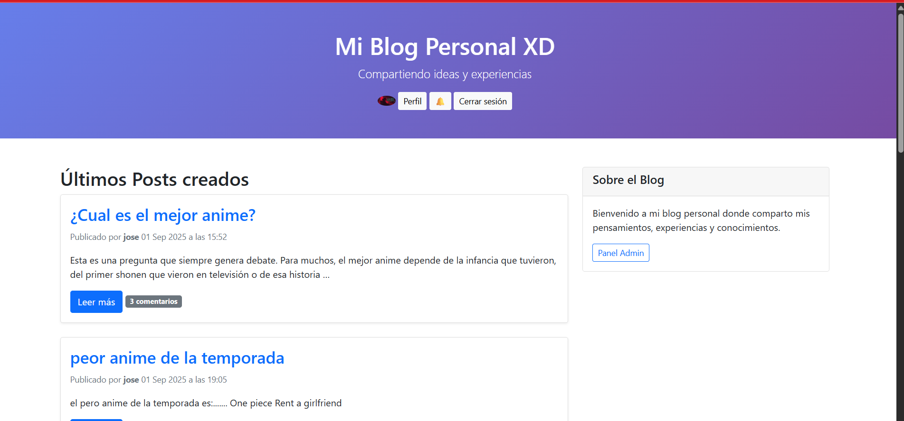
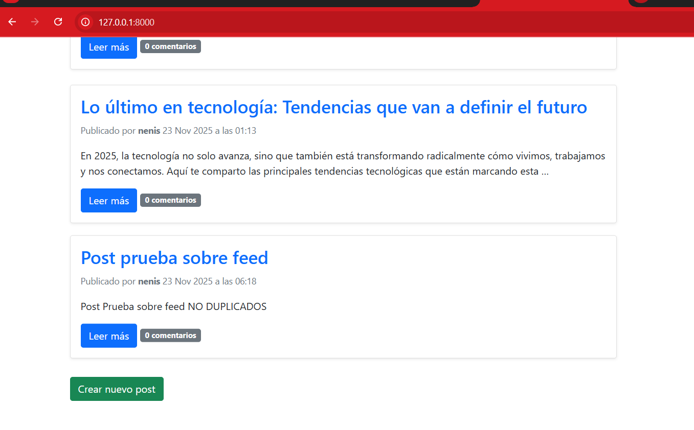
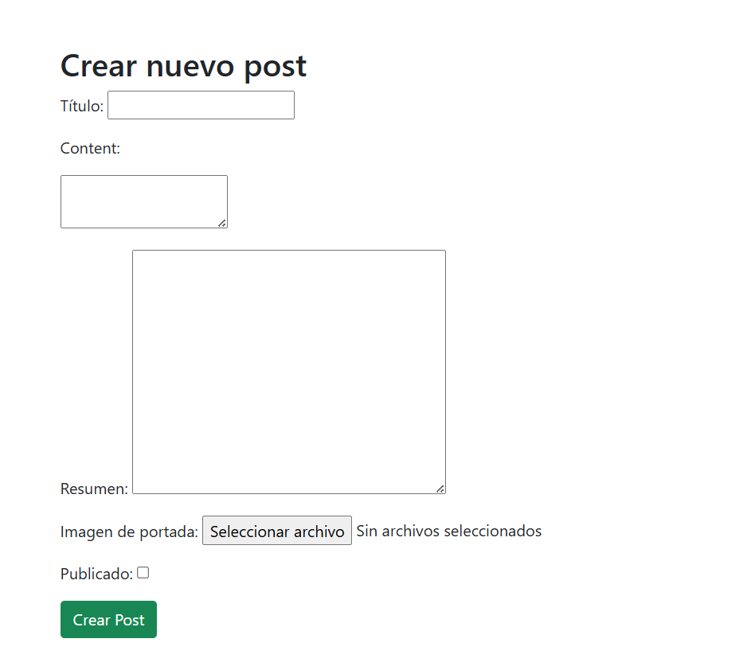
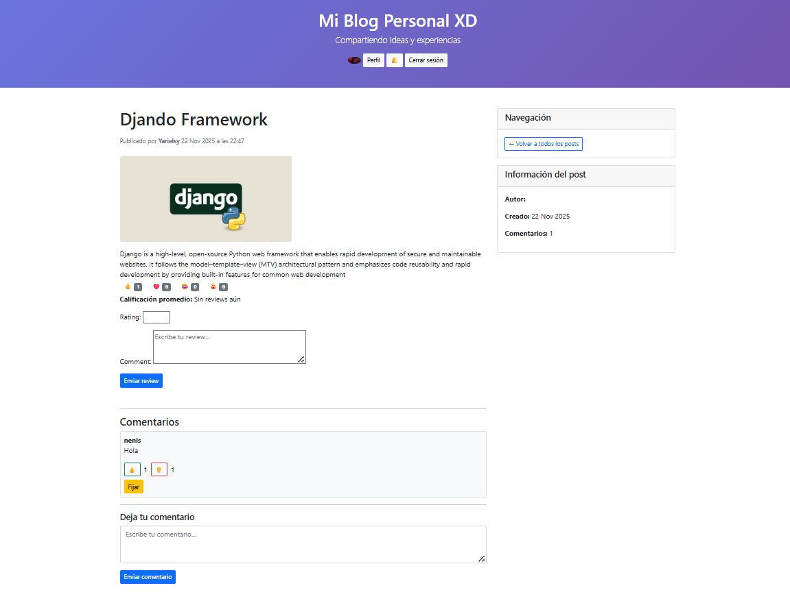
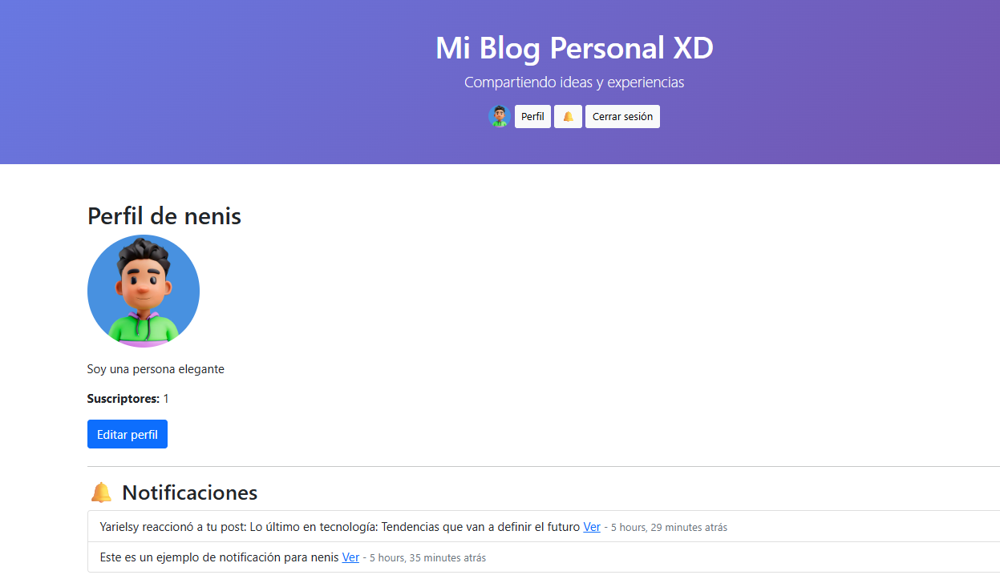

# Proyecto Blog Social
Este proyecto es un blog con funcionalidades sociales: comentarios, reacciones, menciones y suscripciones por autor o tema.

## Instalación
1. Clonar el repositorio:  
git clone <https://github.com/02yari/DjangoMyblog>
2. Entrar al proyecto:  
cd mi_blog
3. Crear y activar el entorno virtual:  
python -m venv venv  
# Windows  
venv\Scripts\activate  
# Mac/Linux  
source venv/bin/activate
4. Instalar dependencias:  
pip install -r requirements.txt
5. Aplicar migraciones:  
python manage.py migrate
6. Crear superusuario (opcional):  
python manage.py createsuperuser

## Cómo correr
python manage.py runserver
Abrir en el navegador: http://127.0.0.1:8000/

## Fixtures de prueba
Se incluyen usuarios, posts y comentarios de prueba:
- users.json  
- posts.json  
- comments.json  

Cargar fixtures:  
python manage.py loaddata users.json  
python manage.py loaddata posts.json  
python manage.py loaddata comments.json
Usuarios de prueba incluidos: nenis, yarielsy, otro_usuario

## Funcionalidades sociales
**Comentarios**: Los usuarios pueden comentar en posts. Solo los comentarios aprobados se muestran públicamente. Comentarios pueden tener votos (up/down).  
**Menciones (@usuario)**: Al escribir @username en un comentario, el usuario mencionado recibe una notificación en la campana. Menciones a usuarios inexistentes se ignoran sin errores. Las notificaciones muestran quién mencionó, dónde (post/comentario) y enlace directo.
**Suscripciones**: Suscripción a autor o etiqueta (tag). Evita duplicados: un usuario no puede suscribirse dos veces al mismo autor o tag. Cuando el autor publica o aparece un post con la etiqueta, el usuario puede ver el feed filtrado:  
- /feed/author/<username>/ → posts publicados solo de ese autor  
- /feed/tag/<tag>/ → posts publicados solo con esa etiqueta
**Reacciones y Likes**: Cada post puede recibir reacciones: like, love, haha, wow. Cada comentario puede recibir votos: upvote o downvote. Reacciones y votos se actualizan con AJAX sin recargar la página.

## Cómo probar las funcionalidades
1. Iniciar sesión con un usuario de prueba  
2. Comentar en un post y usar @username para mencionar a alguien  
3. Suscribirse a un autor o etiqueta desde el perfil del usuario o post  
4. Ver notificaciones en la campana del perfil  
5. Revisar los feeds filtrados: /feed/author/<username>/ y /feed/tag/<tag>/  
6. Probar reacciones y votos para confirmar actualización en tiempo real

## Ejemplos de API / AJAX
Reacciones y votos se manejan con AJAX:  
fetch('/toggle_reaction/<post_id>/<reaction_type>/', { method: 'POST', headers: { 'X-CSRFToken': csrftoken }})  
.then(res => res.json()).then(data => console.log(data))

Suscripciones podrían integrarse con AJAX para actualizar el contador de suscriptores sin recargar.

## Seguridad básica
- Solo usuarios autenticados pueden comentar, reaccionar o suscribirse  
- Usuarios no pueden editar ni borrar posts que no sean suyos  
- Menciones a usuarios inexistentes no generan errores

## Screenshots (opcional)
Screenshot de donde se despliegan los blogs. 

Permite crear un nuevo post

Vista para crear un post

Vista de u  post, funcionalidad de comentar, review, reacciones para el post y comentarios, suscribirse

Vista del perfil me permite tener una imagen ver notificaciones y ver cantidad de suscriptores. 

## Dependencias principales

- Django  
- django-ckeditor-5  
- django-taggit  

Revisa requirements.txt para la lista completa

## Checklist para PR / entrega

- README claro y completo  
- Fixtures incluidos  
- Screenshots añadidos (opcional)  
- Dependencias documentadas
